# Just Bite - Приложение для заказа и доставки еды

**Just Bite** - мобильное приложение для заказа и доставки еды, разработанное на Flutter с использованием Firebase. Приложение позволяет просматривать меню ресторана, добавлять блюда в корзину и оформлять заказ с доставкой

## Функционал

### Стартовый экран

<p align="center">
  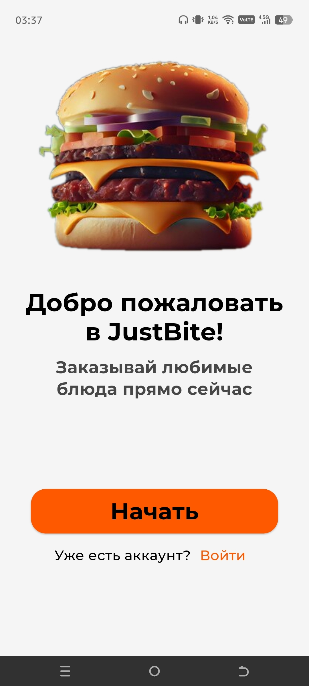
</p>

### Регистрация, Авторизация

- Регистрация по email и паролю
- Вход в аккаунт

<p align="center">
  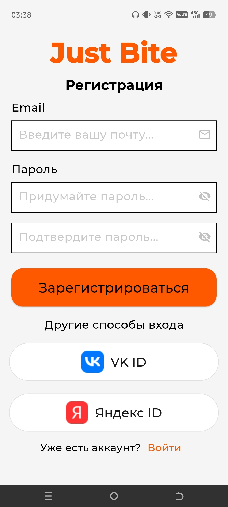
  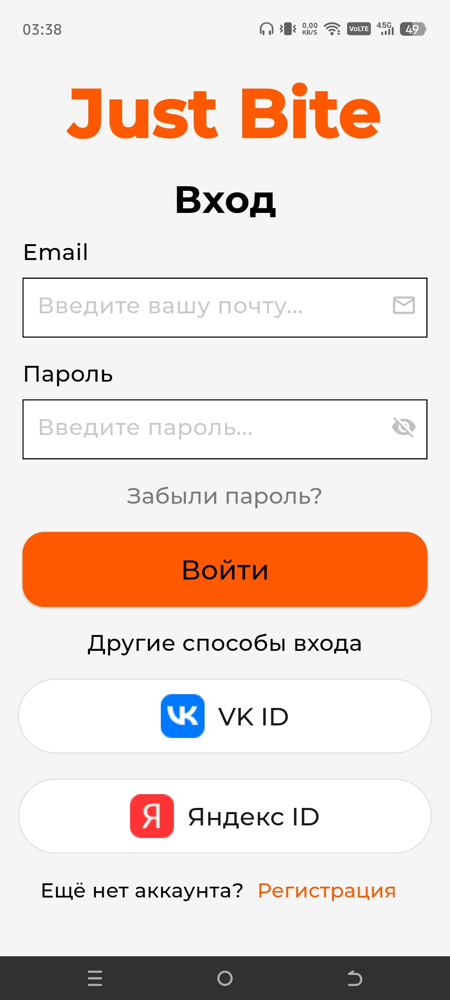
</p>

- Восстановление пароля по почте
- Заполнение данных (имя, номер телефона, адрес, город)

<p align="center">
  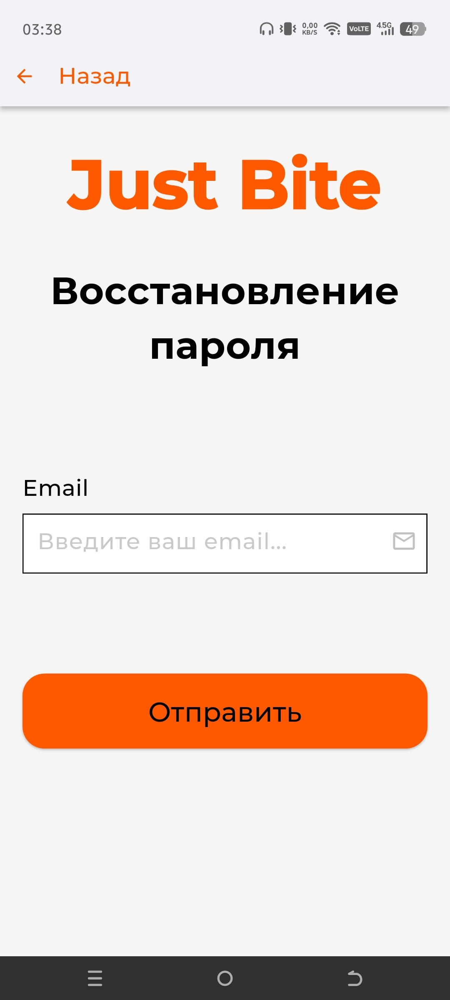
  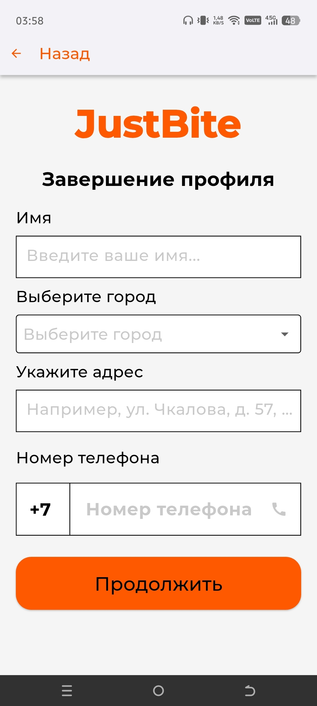
</p>

### Главный экран

- Отображение адреса доставки и имени пользователя
- Список категорий блюд
- Список популярных блюд

<p align="center">
  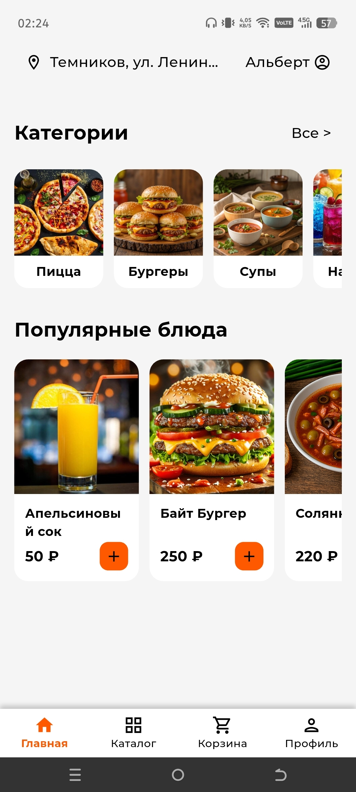
</p>

### Каталог и блюда

- Список всех категорий блюд
- Поиск и фильтрация категорий
- Просмотр блюд по категории
- Поиск блюд по названию
- Категории - Пицца, Бургеры, Супы, Напитки, Завтраки, Салаты, Десерты

<p align="center">
  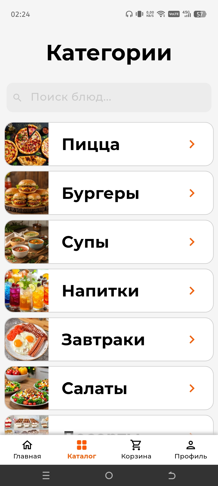
  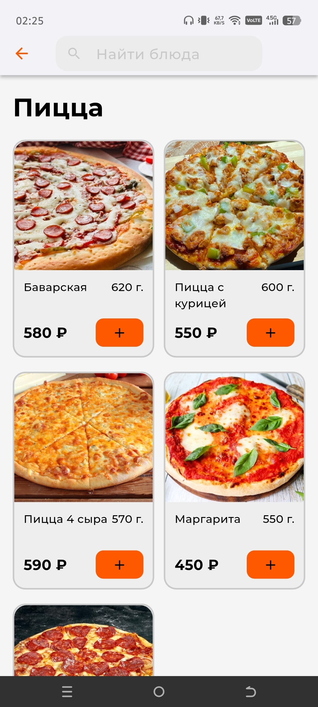
</p>

### Корзина

- Добавление и удаление блюд
- Изменение количества блюд
- Отображение общей суммы
- Очистка корзины

<p align="center">
  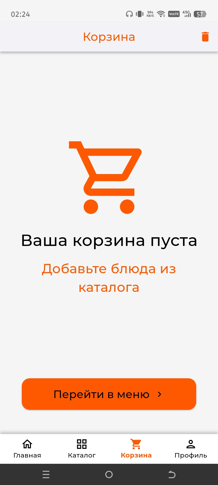
  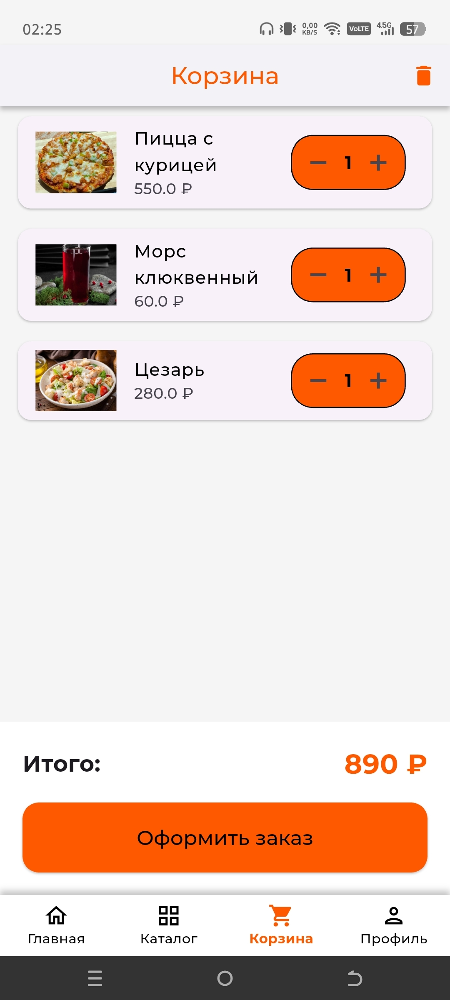
</p>

### Оформление заказа

- Выбор адреса доставки
- Выбор способа оплаты (Наличные/По карте)
- Комментарий к заказу
- Расчет времени приготовления
- Сохранение заказа в Firebase

<p align="center">
  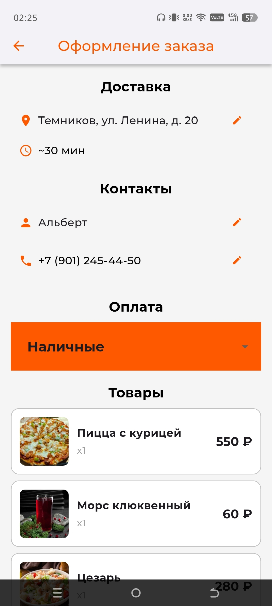
  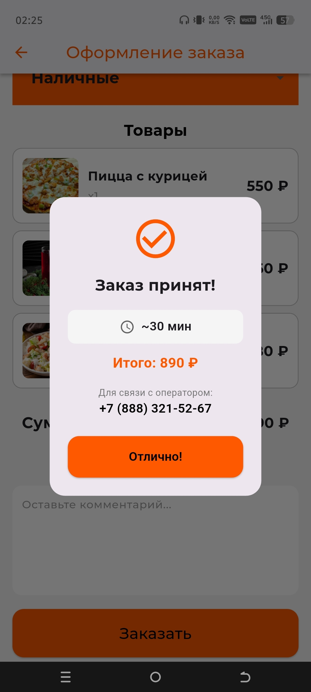
</p>

### Профиль

- Просмотр и редактирование данных
- Выбор города из списка
- Разделы "Мои скидки" и "Мои заказы"
- Выход из аккаунта

<p align="center">
  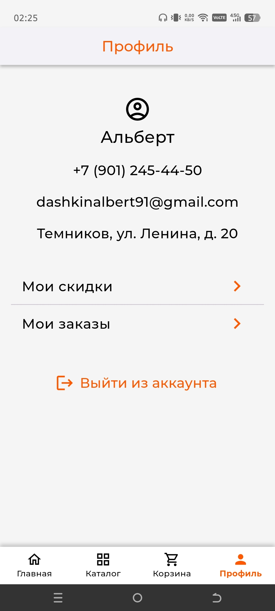
</p>

## Технологии

**Flutter** - кроссплатформенная разработка\
**Dart** - язык программирования\
**Firebase Auth** - аутентификация пользователей\
**Firestore** - хранение данных\
**Imgbb** - хранение изображений (категории и блюда)\

## Структура проекта

```
lib/
├── models/
│ └── cart_item.dart
├── providers/
│ └── cart_provider.dart
├── services/
│ └── order_service.dart
├── screens/
│ ├── basket_screen.dart
│ ├── catalog_screen.dart
│ ├── complete_profile_screen.dart
│ ├── dish_screen.dart
│ ├── forgot_password_screen.dart
│ ├── home_screen.dart
│ ├── login_email_screen.dart
│ ├── login_screen.dart
│ ├── order_screen.dart
│ ├── registration_email_screen.dart
│ ├── registration_screen.dart
│ ├── sms_confirm_screen.dart
│ ├── start_screen.dart
│ └── profile_screen.dart
├── firebase_options.dart
└── main.dart
```

## Установка и запуск

1. **Клонируйте репозиторий:**
```bash
git clone https://github.com/Albert4565/justbite_app.git
```

2. **Установите зависимости:**
```bash
flutter pub get
```

3. **Настройте Firebase:**
- Создайте проект в Firebase Console
- Добавьте Android/iOS приложение
- Скачайте google-services.json (Android) и GoogleService-Info.plist (iOS)
- Поместите файлы в соответствующие папки
- Включите Authentication (Email/Password)
- Создайте базу данных Firestore

4. **Запустите приложение:**
```bash
flutter run
```

## Структура базы данных Firestore

**Коллекция users**

```json
{
    "uid": "user_id",
    "name": "Альберт",
    "email": "pochta@gmail.com",
    "phone": "+7 (900) 123-45-67",
    "phoneRaw": "+79001234567",
    "city": "sarov",
    "cityLabel": "Саров",
    "address": "ул. Пушкина, д. 43",
}
```

**Коллекция categories**

```json
{
    "name": "Пицца",
    "image": "https://.../.../pizza.png",
    "sort_order": 1,
}
```

**Коллекция cities**

```json
{
    "label": "Москва",
    "value": "moscow",
}
```

**Коллекция dishes**

```json
{
    "name": "Маргарита",
    "category": "pizza",
    "price": 450,
    "weight": 550,
    "prepTime": 12,
    "image": "https://.../.../margarita.jpg",
}
```

**Коллекция orders**

```json
{
    "userId": "user_id",
    "items": [...],
    "comment": "Оставьте заказ у двери",
    "status": "Принят",
    "totalAmount": 1150,
    "createdAt": "timestamp",
}
```

## Дизайн и оформление

- **Цвет фона:** #F5F5F5 (светло-серый)
- **Шрифт**: Montserrat
- **Основной цвет:** #FF5900 (оранжевый)

## Авторы приложения

**Дашкин Альберт (ЦТ-33)**\
**Балаев Роман (ЦТ-33)**